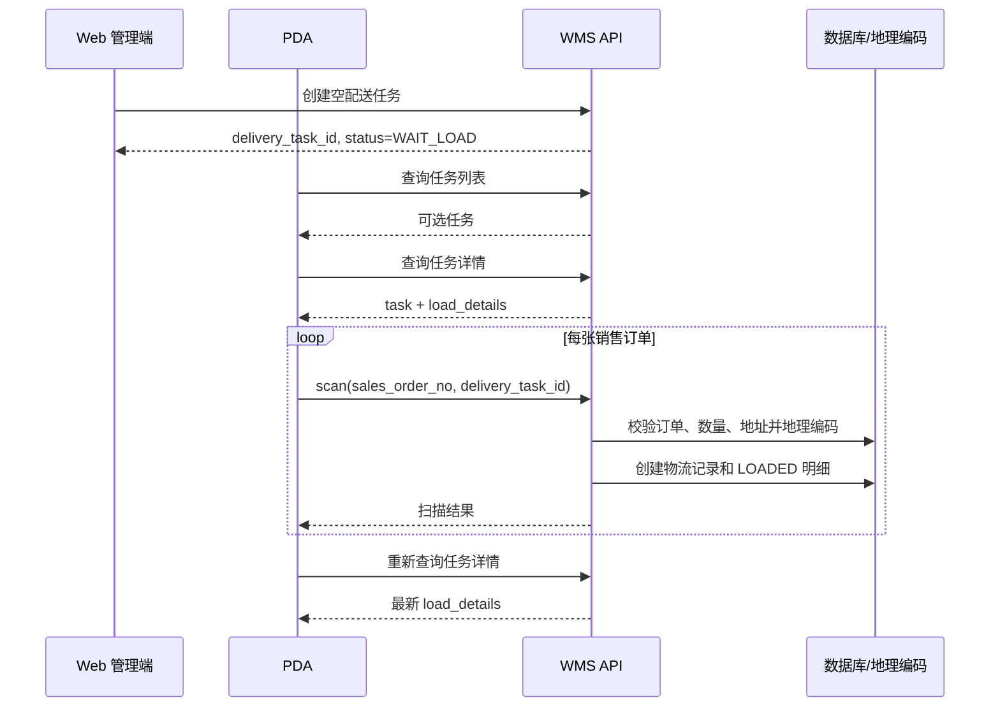

# PDA 接入配送任务功能设计

> 适用项目：`Warehouse-Management/wms-vue3` + `nuomi_wms`  
> 代码核对日期：2026-07-22  
> 文档性质：基于当前代码实现的接口接入说明与 PDA 端功能设计

## 1. 文档目标

本文用于指导 PDA 端接入配送任务，覆盖以下能力：

- 查询配送任务列表和任务详情；
- 在指定配送任务下扫描销售订单并生成装货明细；
- 刷新任务详情，展示已扫描订单、客户、地址和数量；
- 处理重复扫描、业务校验失败、权限失败及网络异常；
- 说明 Web 端“任务详情/编辑”和 PDA 扫描明细之间的真实调用关系；
- 标明当前后端尚未提供或存在边界问题的能力，避免 PDA 端错误依赖。

本文只描述代码中已经存在的接口合同。尚未实现的能力统一放在“现状限制与后续接口建议”中，不视为当前可调用接口。

## 2. 核心结论

### 2.1 扫描明细的添加入口

配送任务详情页没有“手工添加 PDA 扫描明细”的接口。详情页只通过任务详情接口读取并展示 `load_details`，编辑弹窗也只修改承运方、司机、物流公司、计划发车时间和备注。

PDA 向配送任务添加装货明细的实际入口是：

```http
POST /api/v1/tenant-delivery-load/scan
Content-Type: multipart/form-data

sales_order_no=<销售订单号>
delivery_task_id=<配送任务业务ID>
```

其中 `delivery_task_id` 是关键参数：

- 传入：进入“任务驱动模式”，新明细直接绑定该任务，`load_status=LOADED`；
- 不传：进入“先扫码后建任务模式”，新明细保持未分配，`delivery_task_id=null`、`load_status=PENDING`。

PDA 接入推荐使用“任务驱动模式”：先选择一个配送任务，再持续扫描销售订单。

### 2.2 扫描内容

当前接口接收的是 `sales_order_no`（销售订单号），不是：

- `delivery_task_no` 配送任务编号；
- `logistics_no` 系统物流单号；
- `delivery_load_detail_id` 装货明细 ID；
- 历史出库条码 `barcode_code`。

因此 PDA 扫码组件需要从条码/二维码内容中取得完整销售订单号，并原样提交。若现场标签包含前缀、URL 或 JSON，PDA 必须先按双方约定解析出销售订单号；当前服务端不会解析复合码内容。

## 3. 代码定位

| 层级 | 文件 | 作用 |
| --- | --- | --- |
| Web 详情页 | `wms-vue3/src/views/delivery/DeliveryTaskDetail.vue` | 展示 `load_details`；编辑基础信息，不添加明细 |
| Web 新建页 | `wms-vue3/src/views/delivery/DeliveryTaskAdd.vue` | 可选择已有 `PENDING` 明细创建任务，也可预建空任务 |
| 前端扫描 API | `wms-vue3/src/api/modules/deliveryScan.ts` | 封装扫描、待分配列表、删除待分配明细 |
| 前端任务 API | `wms-vue3/src/api/modules/delivery.ts` | 封装任务列表、详情、创建、修改、取消和路线规划 |
| 后端端点 | `nuomi_wms/app/api/v1/endpoints/tenant_delivery_management.py` | 配送任务与扫描接口定义 |
| 扫描业务 | `nuomi_wms/app/services/delivery_service.py` | 订单准入、幂等检查、物流记录及装货明细写入 |
| 路线端点 | `nuomi_wms/app/api/v1/endpoints/tenant_navigation.py` | 配送路线规划和缓存 |
| 数据模型 | `nuomi_wms/app/models/legacy_wms_models.py` | `delivery_task`、`delivery_load_detail`、关联表定义 |

## 4. 业务对象与状态

### 4.1 配送任务 `DeliveryTask`

关键标识：

- `delivery_task_id`：业务 ID，前缀 `dt_`，所有接口传此值；
- `delivery_task_no`：展示编号，格式为 `DT + yyyyMMdd + 4位序号`，不能代替业务 ID 调用详情或扫描接口。

模型定义了以下状态：

| 状态 | 含义 | 当前代码中的实际行为 |
| --- | --- | --- |
| `WAIT_LOAD` | 待装车 | 创建任务时固定进入此状态；允许编辑和取消 |
| `LOADING` | 装车中 | 模型中存在；允许取消 |
| `WAIT_DEPARTURE` | 待发车 | 模型中存在 |
| `DELIVERING` | 配送中 | 模型中存在 |
| `FINISHED` | 已完成 | 扫码接口明确拒绝 |
| `CANCELLED` | 已取消 | 取消接口写入；扫码接口明确拒绝 |

注意：当前代码未找到“开始装车、装车完成、发车、配送完成”端点，也未找到扫描后自动推进任务状态的逻辑。因此 PDA 端不能自行假设扫描会把 `WAIT_LOAD` 改成 `LOADING` 或 `WAIT_DEPARTURE`。

### 4.2 装货明细 `DeliveryLoadDetail`

| 状态 | 含义 | 典型产生方式 |
| --- | --- | --- |
| `PENDING` | 待分配 | 扫描时未传 `delivery_task_id` |
| `LOADED` | 已装车 | 扫描时传入任务 ID，或 Web 创建任务时选中待分配明细 |
| `CANCELLED` | 已取消 | 删除未绑定的待分配明细 |

同一租户内，同一销售订单只能存在一条未删除的 `SALES_ORDER_SCAN` 明细，数据库通过生成列唯一约束保证该规则。

### 4.3 物流记录 `WmsLogisticsBarcode`

首次扫描会同步生成系统物流记录和系统物流单号。与本流程相关的主要状态：

- `PENDING_BIND`：未绑定承运方；
- `ACTIVE`：已有可继续使用的承运信息；
- `ASSIGNED`：已分配到配送任务/承运方；
- `COMPLETED`：已完成；
- `CANCELLED`：已取消；
- `MIGRATION_PENDING`：迁移待处理。

PDA 无需自行生成 `logistics_no`。扫描成功后服务端返回该编号。

## 5. 推荐业务流程

### 5.1 推荐：先建任务，再由 PDA 扫描



PDA 端页面建议分为：

1. 任务列表页：筛选和选择配送任务；
2. 任务装车页：展示任务摘要、已扫描统计、最近扫描结果；
3. 扫码输入层：接收硬件扫描广播或软键盘输入；
4. 明细列表：以任务详情返回的 `load_details` 为唯一服务端结果来源。

### 5.2 兼容：先扫描，再由 Web 组建任务

不传 `delivery_task_id` 调用扫描接口，服务端创建 `PENDING` 明细。Web 新建配送任务页面随后调用待分配列表接口，选择明细，并在创建任务时提交：

```text
scan_detail_ids=["dld_xxx","dld_yyy"]
```

注意 `scan_detail_ids` 是 multipart 表单中的 JSON 数组字符串，不是 JSON 请求体，也不是重复表单字段。

此模式适合仓库先连续扫货、调度稍后组车，不推荐作为 PDA 的默认任务装车流程。

## 6. 通用接口约定

### 6.1 基础约定

- API 前缀：`/api/v1`；
- 鉴权：`Authorization: Bearer <access_token>`；
- 调用身份：租户员工账号，平台管理员不可调用；
- 租户隔离：服务端从 JWT 的 `company_id` 获取，PDA 不传租户 ID；
- 写接口：当前配送模块使用 `multipart/form-data` 或表单编码，不接受普通 JSON 代替；
- 时间：后端序列化为 ISO 8601 字符串，可能为空；
- 分页：`page` 从 1 开始；`page_size` 正常范围 1～100，订阅过期时查询上限会收缩为 10。

除租户管理员外，PDA 使用的角色必须配置对应接口权限。至少需要：

- `GET /tenant-delivery-tasks/list`；
- `GET /tenant-delivery-tasks/detail`；
- `POST /tenant-delivery-load/scan`；
- 可选：`POST /tenant-navigation/driving-route`。

上面列的是权限配置使用的路径标识，均不带 `/api/v1`。路线接口存在一个需要特别注意的历史差异：真实请求 URL 是 `/api/v1/tenant/navigation/driving-route`，权限守卫显式使用的配置标识却是 `/tenant-navigation/driving-route`。PDA 请求必须使用前者，系统权限表必须配置后者。

订阅过期时查询仍可能可用，但所有写操作会返回 403。

### 6.2 登录与 Token 获取

当前系统没有独立的 PDA 设备认证接口，PDA 使用普通租户员工登录流程：

1. `GET /api/v1/captcha` 获取一次性 `captcha_id`、`image_data` 和有效秒数；
2. 展示 Base64 SVG 图形验证码；
3. 以 `application/x-www-form-urlencoded` 调用 `POST /api/v1/auth/user/login`；
4. 表单提交 `account`、`password`、`captcha_id`、`captcha_code`；
5. 从成功响应的 `data.access_token` 取得 JWT，后续放入 Bearer 请求头。

验证码在校验时会被消费，登录失败后必须重新获取。响应还包含 `expires_at`，PDA 应据此提前提示重新登录。当前代码没有 Refresh Token 流程，收到 401 后应清理旧 Token 并回到登录页。

若 PDA 采用设备专用账号或免图形验证码登录，需要另行设计认证接口；不能绕过当前普通员工登录接口的验证码要求。

### 6.3 统一成功响应

```json
{
  "success": true,
  "timestamp": "2026-07-22T10:30:00.000000",
  "message": "扫描成功",
  "data": {}
}
```

PDA 判断成功应同时满足：HTTP 2xx 且 `success === true`。业务数据位于 `data`，不要直接把 HTTP 2xx 当成唯一成功条件。

### 6.4 统一失败响应

字符串型业务错误示例：

```json
{
  "success": false,
  "timestamp": "2026-07-22T10:30:00.000000",
  "message": "PDA扫描销售订单失败",
  "data": "销售订单未完成出库，不允许配送扫码"
}
```

结构化冲突示例：

```json
{
  "success": false,
  "timestamp": "2026-07-22T10:30:00.000000",
  "message": "PDA扫描销售订单失败",
  "data": {
    "errorCode": "DELIVERY_STATE_CONFLICT",
    "message": "该销售订单已分配配送任务，无法重复扫描",
    "logisticsStatus": "ASSIGNED",
    "loadStatus": "LOADED",
    "deliveryTaskId": "dt_xxx"
  }
}
```

成功数据使用蛇形字段 `delivery_task_id`，现有结构化冲突数据使用驼峰字段 `deliveryTaskId`。这是当前后端真实合同，两者不可互换。并非所有 `DELIVERY_STATE_CONFLICT` 都保证带 `deliveryTaskId`：只有查到已装车明细时会返回；仅查到冲突物流记录时可能没有该字段。字段缺失时 PDA 应展示冲突并刷新当前任务详情，不能将其判定为“当前任务已扫描”。

PDA 错误文案提取优先级建议为：

1. `data.message`；
2. `data.detail`；
3. 字符串类型的 `data`；
4. 顶层 `message`；
5. 本地兜底文案。

## 7. 核心接口：扫描并添加装货明细

### 7.1 请求

```http
POST /api/v1/tenant-delivery-load/scan
Authorization: Bearer <token>
Content-Type: multipart/form-data
```

| 字段 | 类型 | 必填 | 规则 | PDA 用法 |
| --- | --- | --- | --- | --- |
| `sales_order_no` | string | 是 | 去首尾空白后长度 1～64 | 扫码得到的销售订单号 |
| `delivery_task_id` | string | 否 | 必须是当前租户未删除的任务 ID | 任务装车模式必须传 |

curl 示例：

```bash
curl -X POST "https://<host>/api/v1/tenant-delivery-load/scan" \
  -H "Authorization: Bearer <access_token>" \
  -F "sales_order_no=SO202607220001" \
  -F "delivery_task_id=dt_xxxxxxxxx"
```

### 7.2 成功响应字段

```json
{
  "success": true,
  "message": "扫描成功",
  "data": {
    "logistics_barcode_id": "lgb_xxxxxxxxx",
    "logistics_no": "LGB202607220001",
    "logistics_status": "ASSIGNED",
    "carrier_type": "PERSONAL_DRIVER",
    "delivery_load_detail_id": "dld_xxxxxxxxx",
    "delivery_task_id": "dt_xxxxxxxxx",
    "load_status": "LOADED",
    "sales_order_no": "SO202607220001",
    "customer_name": "示例客户",
    "customer_phone": "13800000000",
    "delivery_address": "示例地址",
    "detail_address": "示例详细地址",
    "dest_lng": "120.123456",
    "dest_lat": "30.123456",
    "delivery_quantity": 12.0,
    "idempotent_replay": false
  }
}
```

| 字段 | 含义 |
| --- | --- |
| `logistics_barcode_id` | 物流记录业务 ID |
| `logistics_no` | 服务端生成或复用的系统物流单号 |
| `logistics_status` | 物流记录当前状态 |
| `carrier_type` | `UNASSIGNED`、`PERSONAL_DRIVER` 或 `LOGISTICS_COMPANY` |
| `delivery_load_detail_id` | 新装货明细业务 ID |
| `delivery_task_id` | 实际绑定的任务 ID；未传任务时为 `null` |
| `load_status` | 传任务时应为 `LOADED`，未传任务时为 `PENDING` |
| `delivery_quantity` | 订单所有未删除明细的 `actual_out_qty` 合计 |
| `idempotent_replay` | 是否走了现有记录复用分支；详见重复扫码边界 |

任务驱动模式不能只判断顶层成功。PDA 还应校验：

```text
data.delivery_task_id === 当前任务ID && data.load_status === "LOADED"
```

若顶层成功但返回 `delivery_task_id=null` 或 `load_status=PENDING`，说明订单尚未完成当前任务绑定。该情况可能出现在极窄的并发扫描窗口中；PDA 应刷新任务详情，确认不存在后再重试一次，不能直接播放“装车成功”反馈。

### 7.3 服务端准入条件

销售订单必须同时满足：

- 属于当前 JWT 对应租户且未删除；
- `audit_status == 1`，已审核通过；
- `status == 1`，订单有效；
- `warehouse_status == 3`，已完成出库；
- `delivery_method` 已设置且不是 `SELF_PICKUP`；
- 所有订单明细的实际出库数量非负，合计大于 0；
- 有有效收货地址；
- 可从客户送货地址或客户资料取得有效收件电话；
- 地址可以通过高德地理编码取得经纬度；
- 未处于已分配/已完成等不允许重扫的物流或装货状态。

地址选择逻辑：优先使用订单 `receive_address`；客户地址先做规范化精确匹配，匹配不到时取默认地址或第一条；客户没有地址档案时回退到客户资料。地理编码失败返回 422，扫描不会成功落库。

### 7.4 写入结果

首次创建扫描记录会在同一数据库事务内完成：

1. 生成或复用系统物流记录；
2. 生成 `delivery_load_detail_id`；
3. 保存订单、客户、地址、电话、出库数量和经纬度快照；
4. 若传任务 ID，写入 `delivery_task_id` 并设明细为 `LOADED`；
5. 若任务已选择个人司机或物流公司，物流记录继承任务承运信息并进入 `ASSIGNED`；
6. 提交事务后返回扫描结果。

如果订单之前已存在未绑定的 `PENDING` 明细，这次带任务 ID 扫描不会创建新明细，而是复用原 `delivery_load_detail_id`，就地回填任务 ID 并改为 `LOADED`。该复用分支不会完整执行首次创建分支中的所有承运信息同步，详见现状风险。

## 8. 配送任务查询接口

### 8.1 任务列表

```http
GET /api/v1/tenant-delivery-tasks/list
Authorization: Bearer <token>
```

| 参数 | 类型 | 说明 |
| --- | --- | --- |
| `page` | int | 页码，默认 1 |
| `page_size` | int | 每页数量，1～100 |
| `keyword` | string | 匹配任务编号、车辆名、车牌、司机或物流公司 |
| `status` | string | 精确匹配任务状态 |
| `start_date` | string | 计划发车日期起，`yyyy-MM-dd` |
| `end_date` | string | 计划发车日期止，`yyyy-MM-dd` |
| `sort_by` | string | `deliveryTaskNo`、`createdAt`、`updatedAt` |
| `sort_order` | string | `ASC` 或 `DESC` |

第一阶段 PDA 上线合同明确为：只查询并允许扫描 `status=WAIT_LOAD` 的任务。`LOADING`、`WAIT_DEPARTURE`、`DELIVERING`、`FINISHED`、`CANCELLED` 均在客户端禁止扫描。后端当前约束比此合同宽，需按风险章节收紧。

列表 `data`：

```json
{
  "total": 1,
  "page": 1,
  "page_size": 20,
  "items": [
    {
      "delivery_task_id": "dt_xxx",
      "delivery_task_no": "DT202607220001",
      "status": "WAIT_LOAD",
      "license_plate": "浙A12345",
      "driver_name": "张三",
      "customer_count": 0,
      "delivery_quantity": 0.0
    }
  ]
}
```

PDA 使用的任务字段合同：

| 字段 | 类型/可空 | 含义 |
| --- | --- | --- |
| `delivery_task_id` | string | 接口调用使用的任务 ID |
| `delivery_task_no` | string | 展示编号 |
| `status` | string | 任务状态 |
| `carrier_type` | string | `UNASSIGNED`、`PERSONAL_DRIVER`、`LOGISTICS_COMPANY` |
| `vehicle_id`、`vehicle_name`、`license_plate` | string/null | 车辆标识及快照 |
| `driver_id`、`driver_type`、`driver_name`、`driver_phone` | string/null | 司机标识及快照 |
| `logistics_company_id`、`logistics_company_name` | string/null | 物流公司标识及快照 |
| `plan_departure_time` | string/null | 计划发车时间 |
| `actual_departure_time`、`actual_return_time` | string/null | 实际发车/收车时间 |
| `origin_address`、`origin_lng`、`origin_lat` | string/null | 配送起点及坐标 |
| `remark` | string/null | 备注 |
| `created_at`、`updated_at` | string/null | 创建和更新时间 |
| `customer_count` | int | 列表接口聚合的客户数 |
| `delivery_quantity` | number | 列表接口聚合的配送数量 |

时间字符串由后端 `datetime.isoformat()` 生成，当前不附带时区偏移。PDA 在本项目部署中应按业务本地时间 `Asia/Shanghai` 展示，不做 UTC 换算；长期建议后端统一返回带偏移时间。

### 8.2 任务详情

```http
GET /api/v1/tenant-delivery-tasks/detail?delivery_task_id=dt_xxxxxxxxx
Authorization: Bearer <token>
```

响应核心结构：

```json
{
  "success": true,
  "message": "查询成功",
  "data": {
    "task": {
      "delivery_task_id": "dt_xxx",
      "delivery_task_no": "DT202607220001",
      "carrier_type": "PERSONAL_DRIVER",
      "vehicle_id": "veh_xxx",
      "vehicle_name": "配送车1",
      "license_plate": "浙A12345",
      "driver_id": "drv_xxx",
      "driver_type": "INTERNAL",
      "driver_name": "张三",
      "driver_phone": "13800000000",
      "logistics_company_id": null,
      "logistics_company_name": null,
      "plan_departure_time": "2026-07-22T15:00:00",
      "actual_departure_time": null,
      "actual_return_time": null,
      "status": "WAIT_LOAD",
      "origin_address": "示例仓库",
      "origin_lng": "120.100000",
      "origin_lat": "30.100000",
      "remark": null,
      "created_at": "2026-07-22T10:00:00",
      "updated_at": "2026-07-22T10:00:00"
    },
    "load_details": [
      {
        "delivery_load_detail_id": "dld_xxx",
        "delivery_task_id": "dt_xxx",
        "logistics_barcode_id": "lgb_xxx",
        "logistics_no": "LGB202607220001",
        "sales_order_id": "soid_xxx",
        "sales_order_no": "SO202607220001",
        "source_type": "SALES_ORDER_SCAN",
        "carrier_type": "PERSONAL_DRIVER",
        "driver_id": "drv_xxx",
        "driver_type": "INTERNAL",
        "driver_name": "张三",
        "driver_phone": "13800000000",
        "logistics_company_id": null,
        "logistics_company_name": null,
        "carrier_waybill_no": null,
        "product_id": null,
        "product_code": null,
        "product_name": null,
        "specification": null,
        "customer_id": "cus_xxx",
        "customer_name": "示例客户",
        "customer_phone": "13900000000",
        "delivery_address": "示例地址",
        "detail_address": "1号楼",
        "dest_lng": "120.123456",
        "dest_lat": "30.123456",
        "delivery_quantity": 12.0,
        "status": "LOADED",
        "remark": null,
        "created_at": "2026-07-22T10:30:00"
      }
    ],
    "outbound_orders": ["SO202607220001"],
    "route_cache": null
  }
}
```

- `task`：完整任务快照；
- `load_details`：该任务所有未删除装货明细，按创建时间升序；
- `outbound_orders`：任务销售订单关联表中的订单号；
- `route_cache`：已规划路线的展示缓存，未规划时为 `null`。

PDA 扫描成功后应刷新此接口，或先将扫描结果临时加入当前列表再后台刷新。最终以接口返回的 `load_details` 为准。

`load_details` 不包含已软删除明细，排序固定为 `created_at ASC`。详情接口的 `task` 不带列表聚合字段 `customer_count` 和 `delivery_quantity`，PDA 应分别用明细的 `customer_name` 去重计数、对 `delivery_quantity` 求和；不要读取不存在的详情统计字段。

## 9. 可选接口

### 9.1 查询未分配扫描明细

```http
GET /api/v1/tenant-delivery-load/scan-list?page=1&page_size=20&keyword=SO...
```

该接口只返回同时满足以下条件的记录：`PENDING`、未绑定任务、未删除、来源为 `SALES_ORDER_SCAN`。它服务于“先扫码后建任务”模式，不会返回任务下的 `LOADED` 明细。

### 9.2 删除未分配明细

```http
POST /api/v1/tenant-delivery-load/delete
Content-Type: application/x-www-form-urlencoded 或 multipart/form-data

delivery_load_detail_id=dld_xxxxxxxxx
```

只能软删除未绑定任务的待分配明细。已绑定任务的明细不能通过此接口移除，后端提示需要先取消整个配送任务。PDA 任务装车页不应提供“删除已扫明细”按钮，除非后续新增专用卸货/移除接口。

### 9.3 路线规划

```http
POST /api/v1/tenant/navigation/driving-route
Content-Type: application/x-www-form-urlencoded 或 multipart/form-data

delivery_task_id=dt_xxxxxxxxx
```

前置条件：任务起点有有效坐标，至少一个装货明细有有效目的地坐标，有效客户点不超过 16 个。返回距离、时长、停靠顺序、未进入路线的地址、静态图、导航 URI 和高德路径数据，并缓存展示数据到任务。

这是查询权限接口，但调用会写入路线缓存。若 PDA 只负责装车，可不接入。

## 10. 重复扫描、并发和重试策略

### 10.1 当前真实边界

当前代码并非所有扫描场景都可幂等重放：

| 场景 | 当前结果 |
| --- | --- |
| 首次不带任务扫描，产生未绑定 `PENDING` 明细 | 成功，`idempotent_replay=false` |
| 再次不带任务扫描同一订单，原明细仍为 `PENDING` | 成功返回原记录，`idempotent_replay=true` |
| 原来是未绑定 `PENDING`，这次带任务 ID 扫描 | 原明细就地绑定任务并改为 `LOADED`，返回 `idempotent_replay=true` |
| 已存在 `LOADED` 明细，再次扫描同一订单 | HTTP 409，不作为幂等成功处理；响应可能带原任务 ID |
| 物流状态为 `ASSIGNED` 或 `COMPLETED` | HTTP 409 |

因此任务驱动模式下，重复扫同一销售订单通常会收到 409，而不是成功响应。PDA 应将“409 且 `deliveryTaskId` 等于当前任务”展示为“本任务已扫描”，不要重复加入列表；若指向其他任务，应展示阻断错误并提示目标任务。

### 10.2 PDA 客户端策略

- 同一扫描值在请求完成前锁定，禁止并发提交；
- 维护当前任务会话内已成功订单号集合，硬件连扫时本地先去重；
- 只有网络错误、超时和明确的 5xx 才允许自动重试；建议指数退避并限制次数；
- 400、401、403、404、409、422 不自动重试；
- 超时后重试可能得到 409，因为第一次请求可能已在服务端成功提交；此时立即刷新任务详情确认；
- 即使 HTTP 成功，也必须验证返回任务 ID 与装货状态；任务不匹配或仍为 `PENDING` 时不可计入装货成功；
- 不要仅凭本地“请求失败”撤销已展示结果，先用任务详情核对服务端状态；
- 切换任务时清空本地去重集合和最近结果，避免把订单提交到旧任务。

## 11. 错误处理设计

| HTTP 状态 | 常见原因 | PDA 行为 |
| --- | --- | --- |
| 400 | 参数错误、订单未审核/未出库/自提、地址电话缺失；扫描接口中的任务不存在或状态不允许 | 红色提示并停止；不自动重试 |
| 401 | Token 缺失/过期、账号失效、员工业务 ID 缺失 | 清理登录态并跳转登录 |
| 403 | 非租户员工、无接口权限、租户失效、订阅过期 | 禁止继续扫描，展示服务端文案 |
| 404 | 扫描接口中的销售订单不存在；任务详情接口中的任务不存在 | 提示核对条码/刷新任务 |
| 409 | 来源数据扫描期间变化，或订单已分配/完成 | 刷新任务详情；按 `errorCode` 和任务 ID 分流 |
| 422 | 表单校验失败或地址地理编码失败 | 展示具体错误；参数错误需修复客户端，地址错误需后台维护数据 |
| 5xx | 服务端异常或外部服务异常 | 保留扫描值，可有限重试并提供人工重试 |

结构化业务错误码：

- `SCAN_SOURCE_CHANGED`：扫描期间订单状态、地址、电话或数量变化；刷新后重新扫描；
- `DELIVERY_STATE_CONFLICT`：订单已经分配任务，或物流状态不允许重扫。

服务端多数 400 错误目前只有中文字符串，没有稳定 `errorCode`。PDA 不应依赖中文全文做核心业务判断；只有已存在的结构化错误码可用于分支，其余显示原文即可。

422 有两种响应形态。地理编码业务失败时，`data` 是字符串：

```json
{
  "success": false,
  "message": "PDA扫描销售订单失败",
  "data": "地址地理编码失败，无法获取有效坐标"
}
```

框架表单校验失败时，`data` 是 Pydantic 错误数组，数组项通常包含 `type`、`loc`、`msg`、`input`，并可能包含 `ctx`。PDA 可拼接每项 `loc` 和 `msg` 用于调试，面向操作员只需提示“扫描参数格式不正确”。统一异常处理后不会出现顶层 `detail` 字段。

## 12. PDA 页面与交互设计

### 12.1 任务列表页

展示：任务编号、状态、车牌、司机/物流公司、计划发车时间、客户数、配送数量。

进入装车页时必须保存 `delivery_task_id`，界面可同时展示 `delivery_task_no` 供人员核对。禁止使用展示编号调用 API。

### 12.2 任务装车页

建议固定展示：

- 当前任务编号和状态；
- 车辆、司机或物流公司；
- 已扫描订单数、数量合计；
- 最近一次扫描结果；
- 已扫描明细列表；
- 网络状态和当前提交状态。

允许扫码的客户端前置条件建议为 `task.status === WAIT_LOAD`。后端当前只拒绝 `CANCELLED` 和 `FINISHED`，对其他后期状态约束过宽，PDA 应先做更严格的保护。

### 12.3 扫码状态机

```text
IDLE
  -> SCANNING
  -> VALIDATING_LOCAL
  -> SUBMITTING
     -> SUCCESS -> IDLE
     -> ALREADY_SCANNED -> REFRESH_DETAIL -> IDLE
     -> BUSINESS_ERROR -> IDLE
     -> AUTH_ERROR -> LOGIN
     -> NETWORK_ERROR -> RETRYABLE
```

提交期间应关闭扫描监听或忽略后续相同输入。成功时给出声音、震动和绿色视觉反馈；失败时使用不同声音/震动，避免操作员不看屏幕时误判。

### 12.4 客户端伪代码

```ts
async function handleScan(rawCode: string) {
  const salesOrderNo = parseSalesOrderNo(rawCode).trim()
  if (!salesOrderNo || submitting) return
  if (!currentTask || currentTask.status !== 'WAIT_LOAD') {
    showError('当前任务不可扫码装货')
    return
  }
  if (sessionScannedOrders.has(salesOrderNo)) {
    showInfo('本机已扫描该销售订单')
    return
  }

  submitting = true
  try {
    const result = await scanSalesOrder({
      sales_order_no: salesOrderNo,
      delivery_task_id: currentTask.delivery_task_id
    })
    sessionScannedOrders.add(result.data.sales_order_no)
    showSuccess(result.data)
    await refreshTaskDetail()
  } catch (error) {
    const conflictTaskId = getErrorData(error)?.deliveryTaskId
    if (httpStatus(error) === 409 && conflictTaskId === currentTask.delivery_task_id) {
      showInfo('该销售订单已在当前任务中')
      await refreshTaskDetail()
    } else {
      showApiError(error)
    }
  } finally {
    submitting = false
  }
}
```

## 13. 验收测试清单

### 13.1 正常流程

- 能使用租户员工 Token 查询 `WAIT_LOAD` 任务；
- 能进入空任务详情并看到空 `load_details`；
- 扫描满足准入条件的销售订单后返回 `LOADED` 和当前任务 ID；
- 刷新详情后出现相同 `delivery_load_detail_id`；
- 客户、电话、地址、数量与扫描响应一致；
- 连续扫描多个不同销售订单后列表与数量统计正确；
- 退出并重新进入任务后，服务端明细仍完整。

### 13.2 异常流程

- 空码、超过 64 字符的码被拒绝；
- 不存在、未审核、无效、未完成出库、自提订单分别展示服务端原因；
- 实际出库数量为 0 或负数时拒绝；
- 地址或电话缺失时拒绝；
- 地理编码失败时不会把订单显示为扫描成功；
- 无权限、订阅过期、Token 过期时停止扫描；
- 同一订单重复扫描时正确处理 409 并刷新详情；
- `LOADING`、`WAIT_DEPARTURE`、`DELIVERING` 任务均被 PDA 客户端禁止扫描；
- 扫描已绑定其他任务的订单时显示对方任务 ID；
- 请求超时后刷新详情，可识别第一次请求实际已成功的情况；
- 切换任务后不会沿用上一任务的 ID 提交。

### 13.3 数据一致性

- 扫描成功后 `delivery_load_detail.delivery_task_id` 等于当前任务 ID；
- 明细状态为 `LOADED`；
- 同一租户同一销售订单不存在两条未删除新流程明细；
- 跨租户无法查询或绑定任务；
- 已取消和已完成任务无法扫描；
- 任务承运方已指定时，物流记录承运信息符合预期。

## 14. 当前实现限制与接入风险

以下结论来自当前代码，PDA 上线前需要产品与后端共同确认：

1. **任务详情编辑接口不能增删装货明细。** PDA 只能通过扫描添加；已绑定明细没有单条移除接口。
2. **任务驱动的重复扫码不是完整幂等。** 已存在 `LOADED` 明细时返回 409；PDA 必须按本文策略兼容。
3. **扫码允许的任务状态过宽。** 后端只禁止 `CANCELLED`、`FINISHED`，理论上 `WAIT_DEPARTURE`、`DELIVERING` 仍可扫码。PDA 应先限制为 `WAIT_LOAD`，后端建议同步收紧。
4. **扫描不会推进任务状态。** 当前任务创建后为 `WAIT_LOAD`，没有因首扫、末扫而自动改变状态。
5. **未实现任务生命周期操作。** 当前端点中没有开始装车、装车完成、发车、送达/完成接口，PDA 无法闭环配送生命周期。
6. **任务驱动扫描未创建 `DeliveryTaskOutboundRel`。** 任务详情的 `load_details` 会出现新明细，但 `outbound_orders` 可能不包含 PDA 后扫订单；不能用 `outbound_orders` 作为装货明细真值。
7. **路线缓存不会在新增扫描明细时自动失效。** 已规划路线后继续扫码，详情中的 `route_cache` 可能是旧路线，必须重新调用路线规划。
8. **承运快照存在一致性风险。** 新扫描记录会更新物流记录承运方，但装货明细的司机/物流公司快照在部分任务驱动分支可能未完整继承任务字段。PDA 展示承运方应优先使用 `task`，不要依赖单条明细快照。
9. **并发边界仍需压测。** 代码包含行锁和二次幂等检查，但任务驱动并发请求与数据库唯一约束冲突的最终响应需要在真实数据库环境验证。
10. **现场标签格式尚未在代码中定义。** PDA 开发前必须由业务方提供样码，并冻结字符集、大小写、前后缀以及复合码解析规则。未确认前只能实现“整段内容即销售订单号”的默认模式。

## 15. 建议的后端最小补充（非当前接口）

若目标是让 PDA 完整承担装车和配送，建议按优先级补充：

1. 收紧扫描接口：仅允许 `WAIT_LOAD` 或明确允许的 `LOADING`；
2. 让同任务重复扫描返回稳定幂等成功，异任务重复扫描返回 409；
3. PDA 扫描绑定任务时同步维护 `DeliveryTaskOutboundRel`；
4. 新增绑定明细后清空 `route_cache`；
5. 完整同步任务、物流记录和装货明细的承运快照；
6. 提供“移除任务内单条装货明细”接口，并定义可操作状态；
7. 提供显式生命周期接口，例如开始装车、装车完成、发车、配送完成；
8. 为所有业务失败返回稳定 `errorCode`，减少 PDA 对中文文案的依赖。

在上述接口落地前，PDA 第一阶段建议只实现“选择待装车任务 → 扫描添加 → 查看装货明细”，不要实现发车和配送完成按钮。

## 16. 接入交付清单

PDA 联调前应由管理端/后端确认：

- 测试环境 API 基地址和 HTTPS 证书；
- PDA 员工账号、角色及三项核心接口权限；
- 销售订单标签的实际编码格式；
- 可用于正向和各类异常测试的销售订单；
- 高德地理编码配置在测试环境可用；
- `WAIT_LOAD` 是否为 PDA 唯一允许扫描状态；
- 重复扫描 409 的产品提示方式；
- 是否接受第一阶段不支持单条移除、发车和完成；
- 日志排查时可使用的任务 ID、订单号、明细 ID 和请求时间。

完成以上确认后，PDA 可以按本文现有接口完成第一阶段装车扫描接入。
